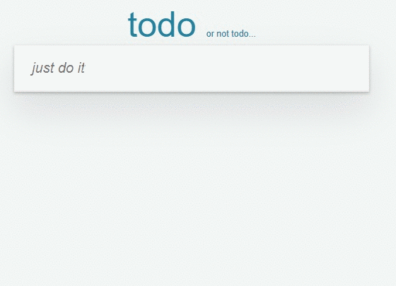

# Simple todo

Простой список дел. Можно добавлять, удалять, редактировать и помечать выполненные задачи. Для хранения данных используется локальное хранилище (localStorage).



## Запуск

Для запуска достаточно открыть файл index.html в корне проекта.

## Сборка

Для сборки проекта были использованы webpack и babel.

Чтобы собрать проект нужно выполнить: 
```bash
npm run build
```